*Tunnelbana* atau kereta bawah tanah merupakan salah satu moda transportasi andalan di Kota Stockholm. Moda transportasi ini tercatat mengangkut lebih dari 350 juta penumpang pada tahun 2017—menempatkannya pada posisi ke-36 sebagai sistem kereta bawah tanah tersibuk di dunia.

Jalur perdana *tunnelbana* pertama kali dibuka pada tahun 1950 dan kini tidak kurang dari 100 stasiun aktif beroperasi. 47 stasiun berada di bawah tanah dan 53 lainnya berdiri di atas tanah. 90 stasiun di antaranya dihiasi dengan patung, lukisan, mosaik, mural, dan beragam instalasi seni.

Dengan panjang jalur lebih dari 100 kilometer, sistem kereta bawah tanah Stockholm dikenal sebagai galeri seni terpanjang di dunia.

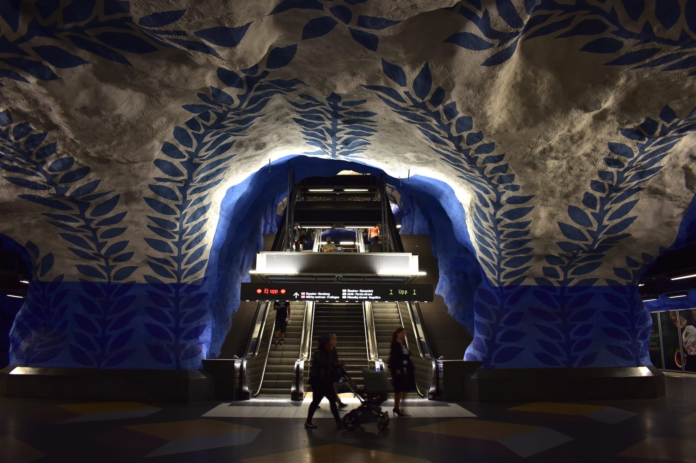

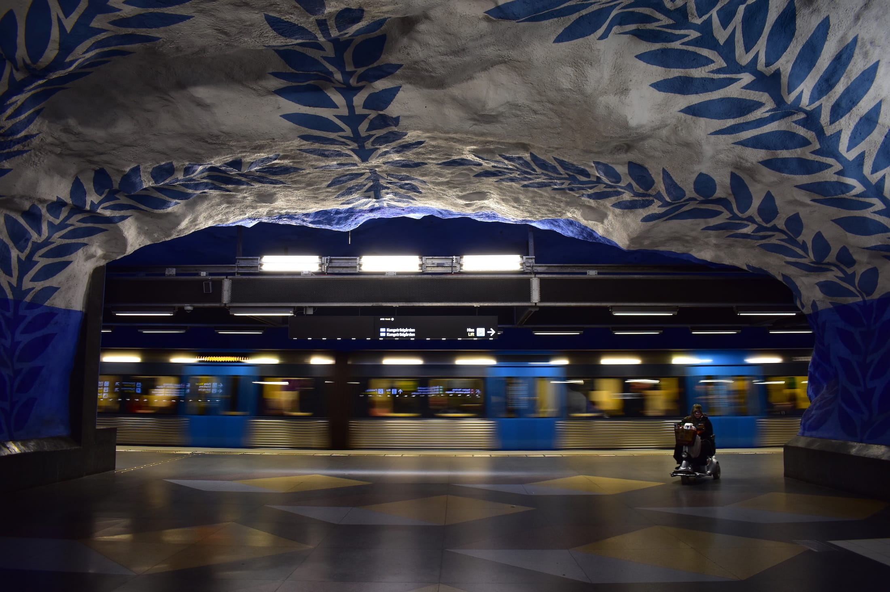

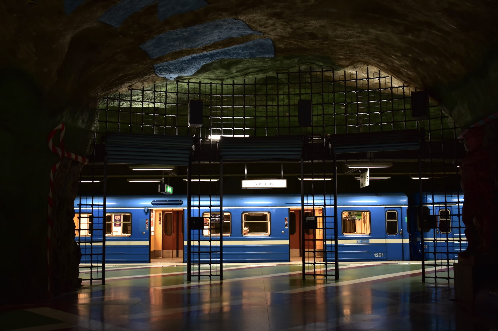

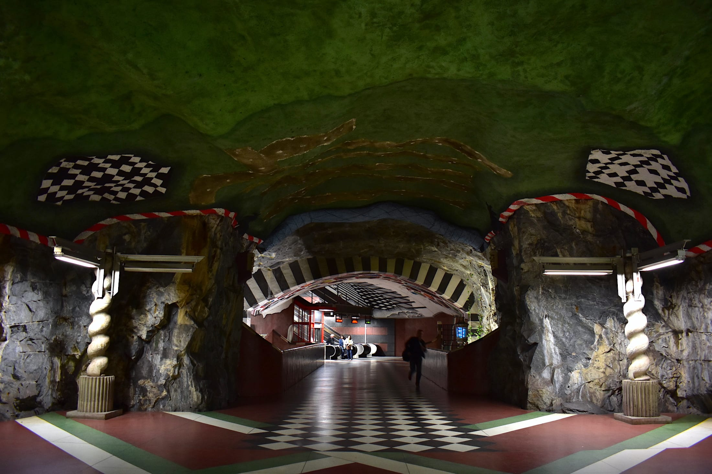

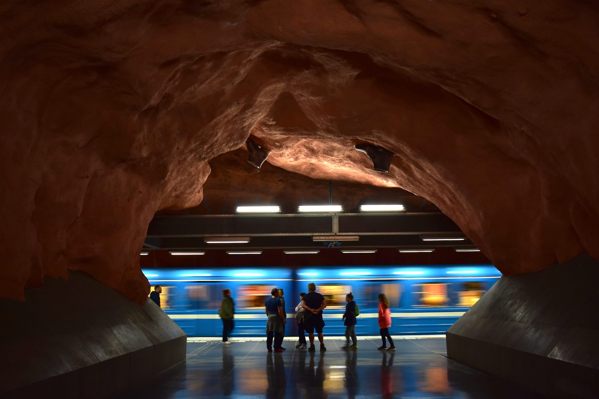

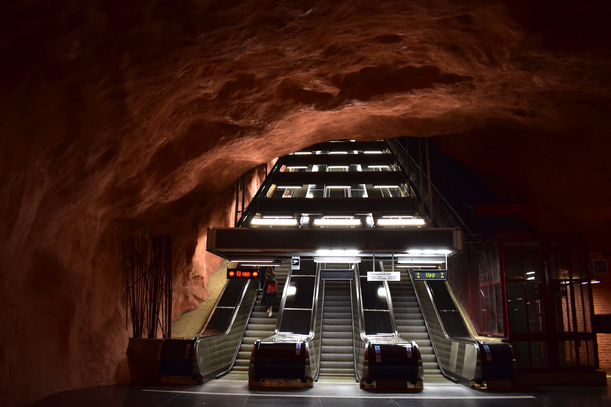

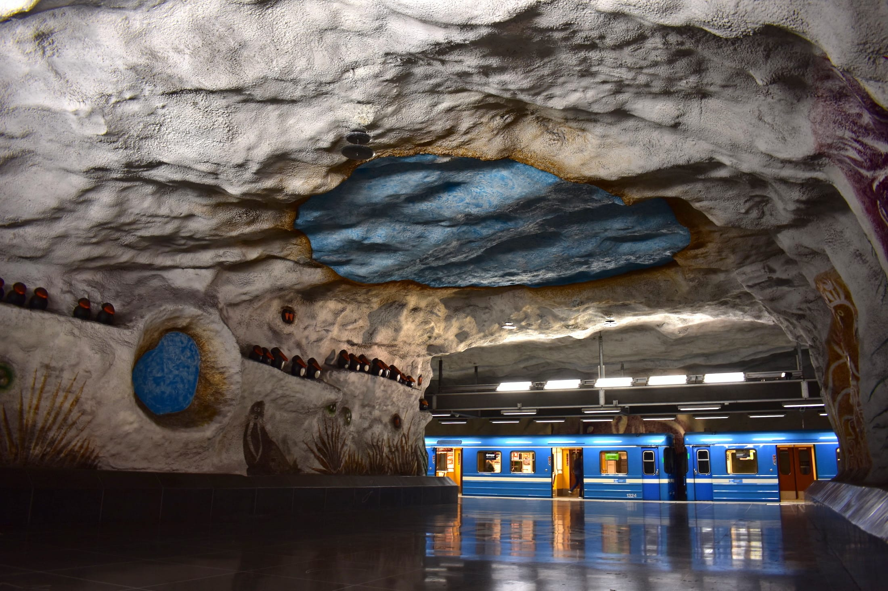

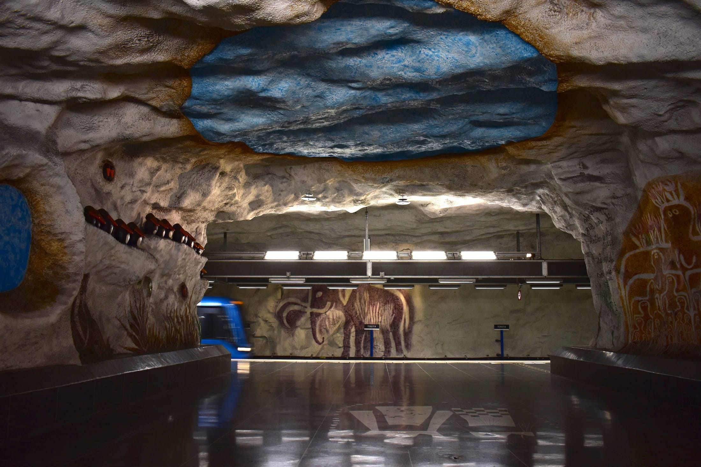

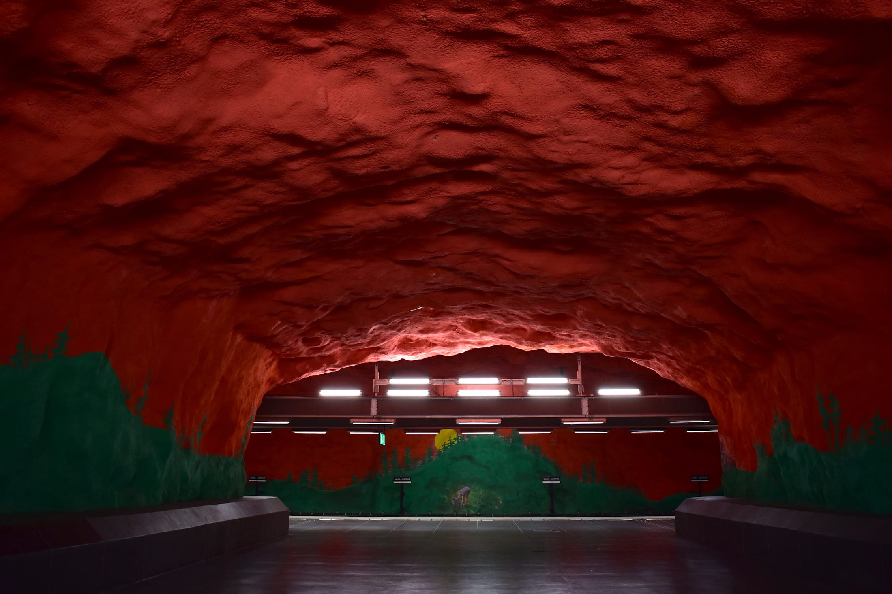

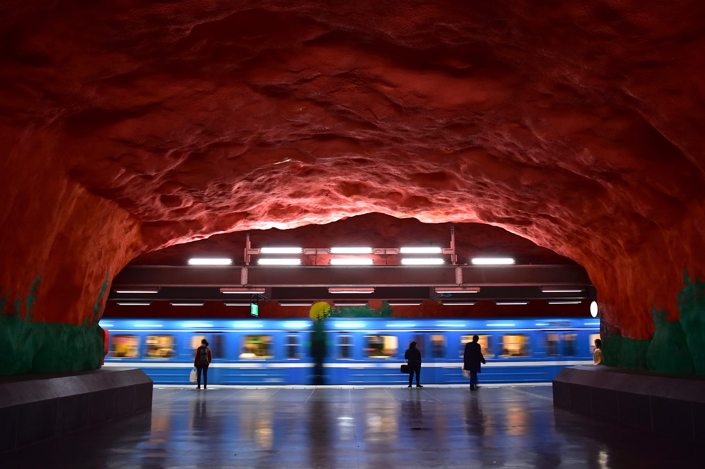

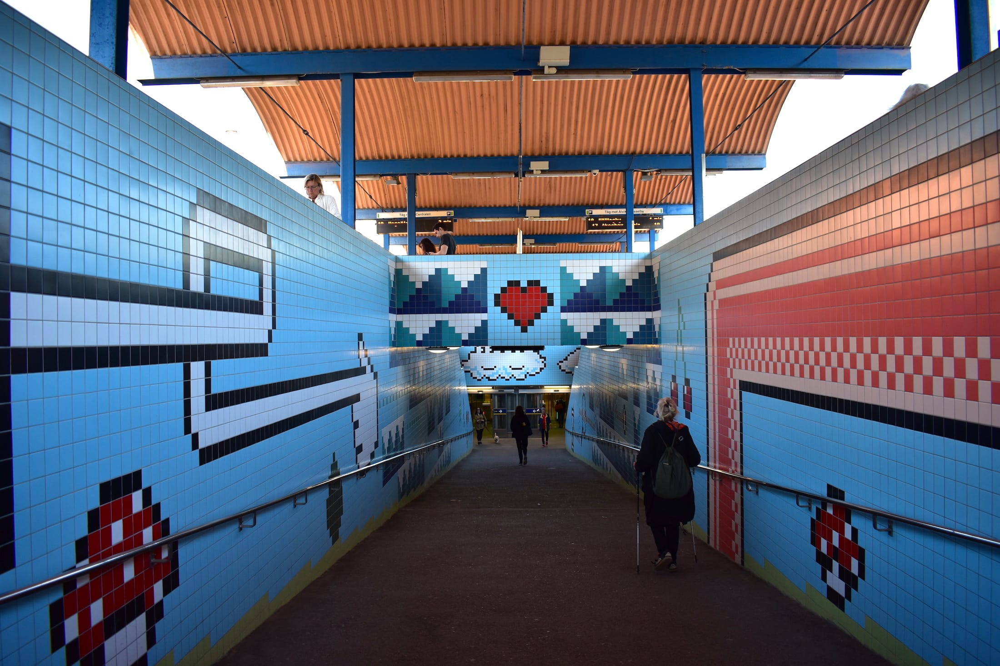

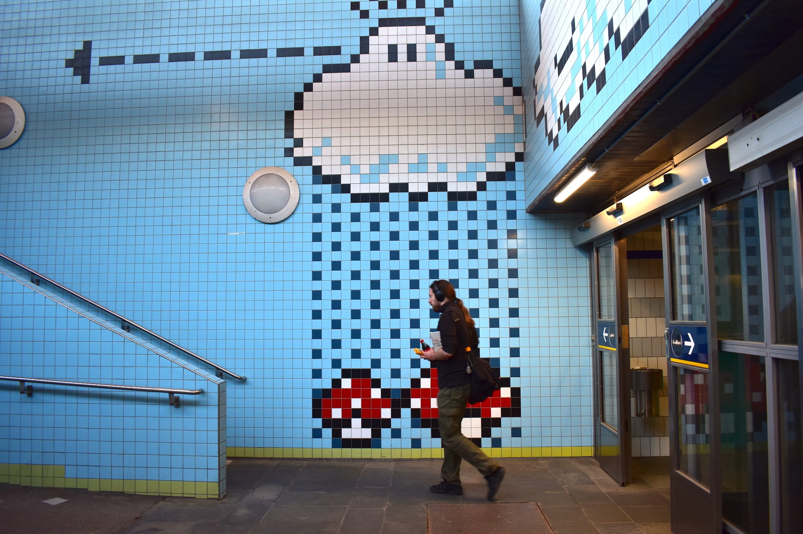

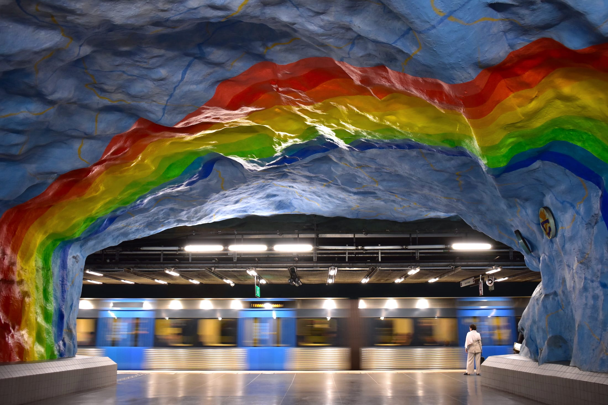
